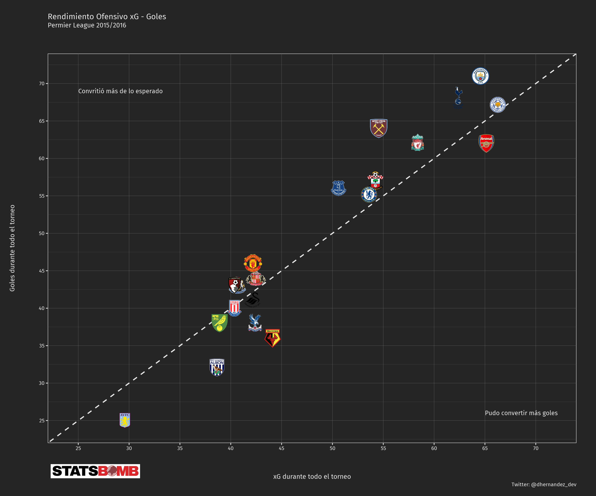
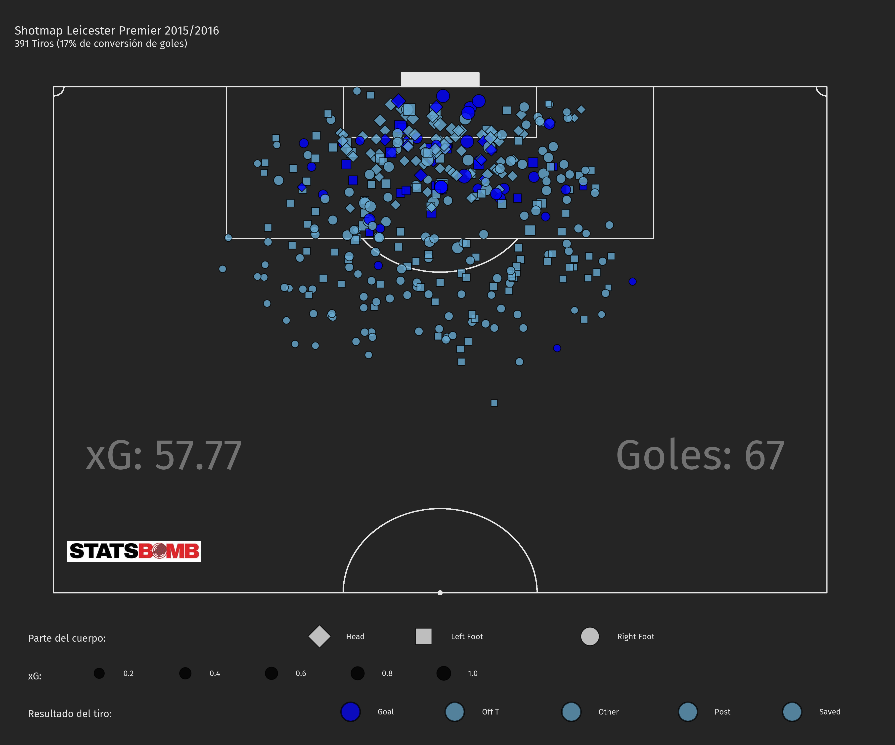
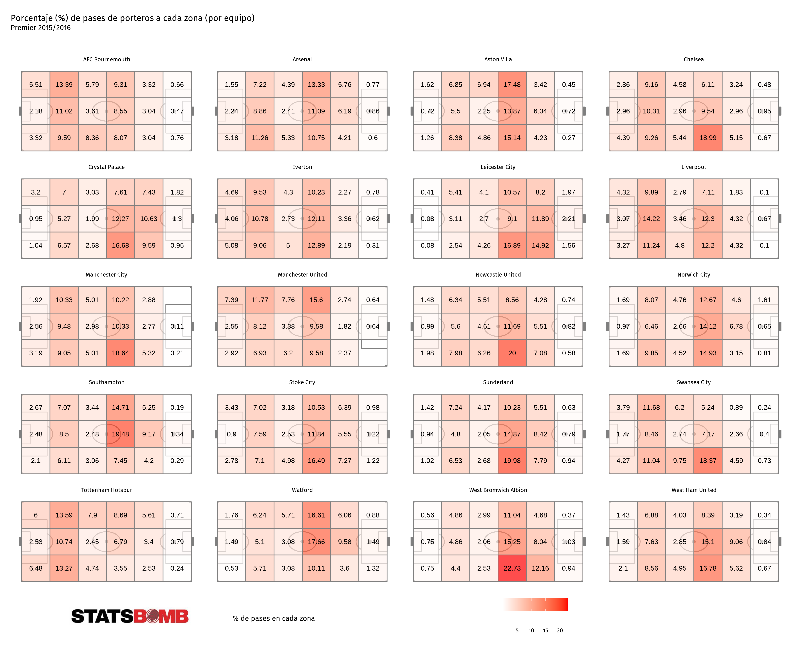
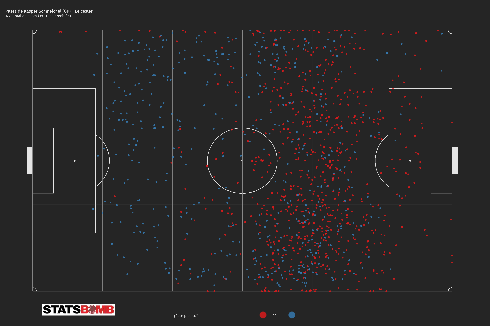
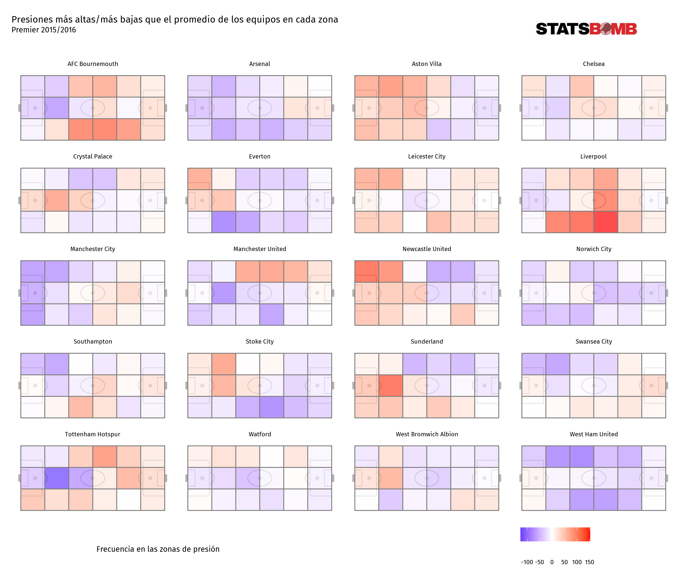

# Analizando el Leicester Campeón

La premier de la 2015-2016 será recordada por todos los amantes del fútbol como esta temporada histórica del Leicester campeón, pero ¿Fue ese campeonato suerte del Leicester o realmente tuvo un rendimiento como para ser campeón? ¿Tan mal jugaron el resto de los equipos para que este equipo saliera campeón? El Fútbol es un deporte de situaciones, por más que juegues bien o mal, en segundos te puede cambiar el rumbo del partido, pero para ganar un torneo y uno tan exigente como la Premier League hay que tener algo más de suerte y buenos jugadores así que a través de los datos reviviremos algunos detalles de ese hito histórico.

## Una delantera peligrosa

Para medir la calidad de su delantera, se utilizó el xG  como métrica para saber que tan peligrosa era su delantera y si fue casualidad su rendimiento goleador.  Leicester fue el equipo que más xG generó durante todo el torneo (**66 xG**) así que era de esperarse esa cuota goleadora (**67 Goles**) por la cantidad de veces que llegaban al área y los lugares tan peligrosos para la defensa donde lograban sus tiros. De la relación con el xG con los goles podemos definir que:

El xG mide la calidad de su delantera generando ocasiones peligrosas, de ahí a que termine en gol sí podría decir que esté el “*factor suerte*” como que el portero esté mal posicionado, termine en autogol o el delantero tenga buena puntería en ese momento. 

En el gráfico de abajo se puede ver el rendimiento ofensivo del Leicester en comparación con el resto de los equipos, mientras más a la esquina superior izquierda quiere decir los equipos que generaron muchas ocasiones, pero no concretaron tantas y mientras más a la esquina inferior derecha es que hicieron muchos goles, aunque no llegaron tanto al área.

Otra manera de ver este rendimiento es con un mapa de tiros del equipo, donde tuvieron un 19% de conversión de tiros, es decir que, aunque tuvieron una alta cantidad de goles, hacían muchos tiros lejanos y en posiciones no tan favorables, la ventaja es que la mayoría fue en una zona central aumentando el xG y facilitando posibles segundas jugadas.

### Vardy, el dueño del área rival

Vayamos un poco más a detalle, siendo Jamie Vardy el goleador del equipo, no es casualidad sus 24 goles que se llevó en el torneo siendo esto un rendimiento excelente en relación a la cantidad de tiros y la calidad de estos (20.24 xG).

## En defensa, una muralla china

El Leicester fue el 4to equipo que menos goles recibió durante todo el torneo (**36 goles**), aunque pudo llegar a recibir más goles por la cantidad y la calidad de las ocasiones de sus oponentes al llegar al área (**45xG**), una de las razones que puede explicar que esto no llegara a pasar puede ser la calidad de su portero Kasper Schmeichel siendo él en muchas ocasiones el que evitó que la pelota terminara en la red. De la relación del xG en contra y los goles concebidos podemos definir que:

Un alto xG en contra mide la calidad de las ocasiones de peligro que le generaron a la defensa como la cantidad de tiros que permitieron y las posiciones tan peligrosas de los delanteros contrarios a la hora de disparar a puerta mientras que una menor cantidad de goles permitidos se le puede atribuir a que tenían un gran arquero o que simplemente los delanteros rivales no tuvieron la puntería necesaria en algunas ocasiones. 

En el gráfico siguiente se puede ver el rendimiento defensivo del Leicester en comparación con el resto de los equipos de la premier donde mientras más arriba a la izquierda quiere decir que un equipo recibió más goles de lo esperado según las ocasiones que le generaron, mientras que más abajo a la derecha quiere decir que a pesar de que le generaron muchas ocasiones de peligro, no fueron muchas las que terminaron en gol.

## Para ganar, hay que hacer más goles de los que nos hacen

Ya sabiendo como estuvo el rendimiento del equipo tanto a nivel defensivo como a nivel ofensivo, podemos unir estas comparaciones para tener una visión un poco más general del equipo, esta medida va a ser a través del ****Ratio**** para ambas fases. A nivel ofensivo, un ratio mayor a 1 quiere decir que el rendimiento ofensivo fue excelente, mientras que a nivel defensivo esto ocurre cuando la ratio es menor a 1, a cualquier nivel un ratio igual a 1 quiere decir que fue un rendimiento equilibrado, ni sobresaliente ni deficiente.

El Leicester a nivel ofensivo tuvo un rendimiento equilibrado pero positivo con un **ratio cercano al 1.1** y a nivel defensivo fue más sobresaliente con **un ratio menor a 0.8** así que de manera general se puede decir que tuvo un rendimiento excelente en cuanto a hacer más goles de los que permitió.

En la tabla siguiente se puede ver la relación de los ratios y cuando es un rendimiento excelente, deficiente o tiene mejor una faceta o la otra. En el gráfico se puede ver ese rendimiento en comparación con el resto de los equipos de la premier.

*Ratio → Comparación entre 2 grupos que expresa cuanto más grande es un grupo sobre otro, en este caso el xG y los Goles tanto a favor y en contra durante todo el torneo.*

| Rendimiento | Significado de ese rendimiento |
| --- | --- |
| Excelente Rendimiento | El ratio xG-Goles a favor es mayor a 1, lo que quiere sugiere que el equipo tuvo una mayor eficacia en la conversión de goles y El ratio xG-Goles en contra es menor a 1, lo que sugiere que el equipo tuvo una mayor eficacia defensiva. |
| Mejor Rendimiento Ofensivo que Defensivo | El ratio xG-Goles a favor es mayor a 1, lo que sugiere que el equipo tuvo una mayor eficacia en la conversión de goles y El ratio xG-Goles en contra es mayor a 1, lo que sugiere que el equipo tuvo una menor eficacia defensiva. |
| Mejor Rendimiento Defensivo que Ofensivo | El ratio xG-Goles a favor es menor a 1, lo que sugiere que el equipo tuvo una menor eficacia en la conversión de goles y El ratio xG-Goles en contra menor a 1, lo que sugiere que el equipo tuvo una mayor eficacia defensiva. |
| Mal Rendimiento | El ratio xG-Goles a favor es menor a 1, lo que sugiere que el equipo tuvo una menor eficacia en la conversión de goles y El ratio xG-Goles en contra es mayor a 1, lo que sugiere que el equipo tuvo una menor eficacia defensiva. |

## Su arquero, el primer pasador

Los saques de meta son, en muchas ocasiones el inicio de jugadas peligrosas que pueden terminar en gol, el patrón de las zonas donde el arquero suele mandar el balón (2da fila, 3er cuadro), es muy similar al resto de los arqueros de la premier, Con una tendencia a la zona alta de la parte derecha del campo, con más del 20% de sus pases a esa zona, con esto se puede deducir que el equipo no solía jugar muchos con los centrales, sino que buscaba saltar línea con balones largos.

Para poder observar este patrón dividí el campo en 18 zona, siendo de arco a arco, el carril central y 2 laterales, junto con 6 fases donde serían la zona baja, zona media baja, 2 zonas medias, zona media alta y zona alta, siendo la primera y la última el área de cada equipo.

### Mientras más lejos, menos preciso

Cada vez que Schmeichel buscaba dar un pase, tenía esta tendencia de buscar al balón largo, pero solía ser muy divido incluso llegando a perder la posesión, donde era común hasta terminar con un saque lateral del equipo contrario, de los más de 1000 pases que realizó tuvo un 39% de pases siendo estos exitosos en su mayoría cuando jugaba en corto en la zona media baja.

## Saques de esquina, otra manera de generar peligro

En los saques de esquina, mientras más fuera a la zona centra (frente al arco) aumentando su xA (probabilidad que el pase termine en asistencia), como se puede ver en el gráfico, esta opción no era de los fuertes ofensivos del equipo, aunque más del 90% del centro de esquina fueron a la zona central, solo 4 goles convirtieron desde ahí.

## Sin dejar respirar al rival

Manteniendo en el capo esta división de 18 zonas, mientras cada una esté más al rojo quiere decir que el equipo presionaba más en esa zona que el resto de los equipos y mientras más azul quiere decir que presionaban menos en esas zonas, las zonas blancas quieren decir que presionaban con una intensidad similar al resto de los equipos.

El Leicester al momento de presionar, no era tan agresivo en la zona media como en las zonas laterales, donde era más intenso en los laterales de la zona baja, posiblemente porque era común que los equipos contrarios manejaran mucho el balón en esas zonas, donde tenían que ir a presionar.

## Partido igualado, más intenso

Otra manera de ver que tanto presionaba el equipo es según el contexto del partido, un equipo no juega igual cuando va ganando, perdiendo o empatando.

El Leicester, al ir empatando, presionaban más en la zona media, media baja, no tanto en su zona alta, pero en general eran más intenso, cuando iban ganando bajaban la intensidad y cuando iban perdiendo, la intensidad de presión era casi nula, pero esto último se podría explicar que el al necesitar hacer los goles, controlaban mayor tiempo la posesión, entonces si tú tienes el balón, no estas presionando al otro equipo. Esto lo comprobaremos más adelante.

## Un equipo que cede el balón

La presión al rival va mucho de la mano con que tan seguido tienes el balón, si tú tiene el balón la mayor parte del tiempo, entonces no estas presionando al equipo rival y una tendencia que se puede observar en los equipos de la premier, es que esto ocurre cuando están perdiendo y el Leicester no es la excepción.

En el gráfico se puede observar que el equipo (Tercero de abajo hacia arriba) no es un equipo que en promedio no tenía el balón la mayor parte del juego, de por sí fue el 3er equipo que menos posesión tenía por partido, aun así, cuando el equipo iba perdiendo podía llegar a dividir el balón hasta casi un 50% de la posesión del balón en esa situación, en comparación a cuando iba empatando era poco más del 40% de la posesión o incluso ganando que cedía el balón hasta tener menos del 40% de la posesión del partido.

