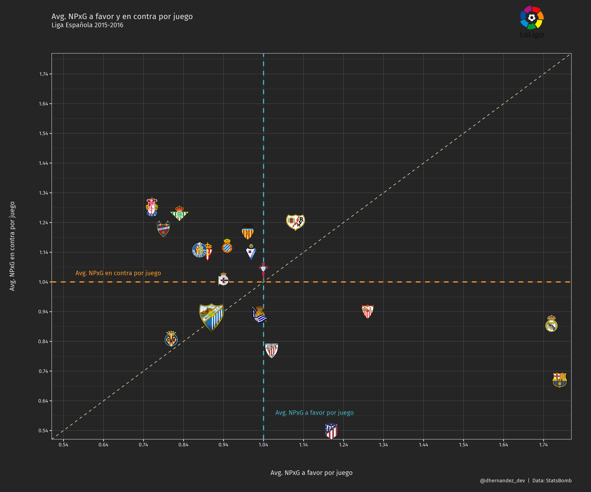

# Rendimiento de equipos

Rendimiento de equipos de la liga española en la temporada 2015-2016 basado en su xG

La estructura de los archivos:
- archivo para calcular el xG en contra
- archivo para graficar el rendimiento de los equipos segun su xG
- carpeta con los logos de los equipos
- csv con los datos calculados y analizados
- grafico

Puedes leer el artículo con el analisis para el que se usó este código [aquí](https://dhernandez.dev/posts/xg-para-rendimiento-de-equipos/)

