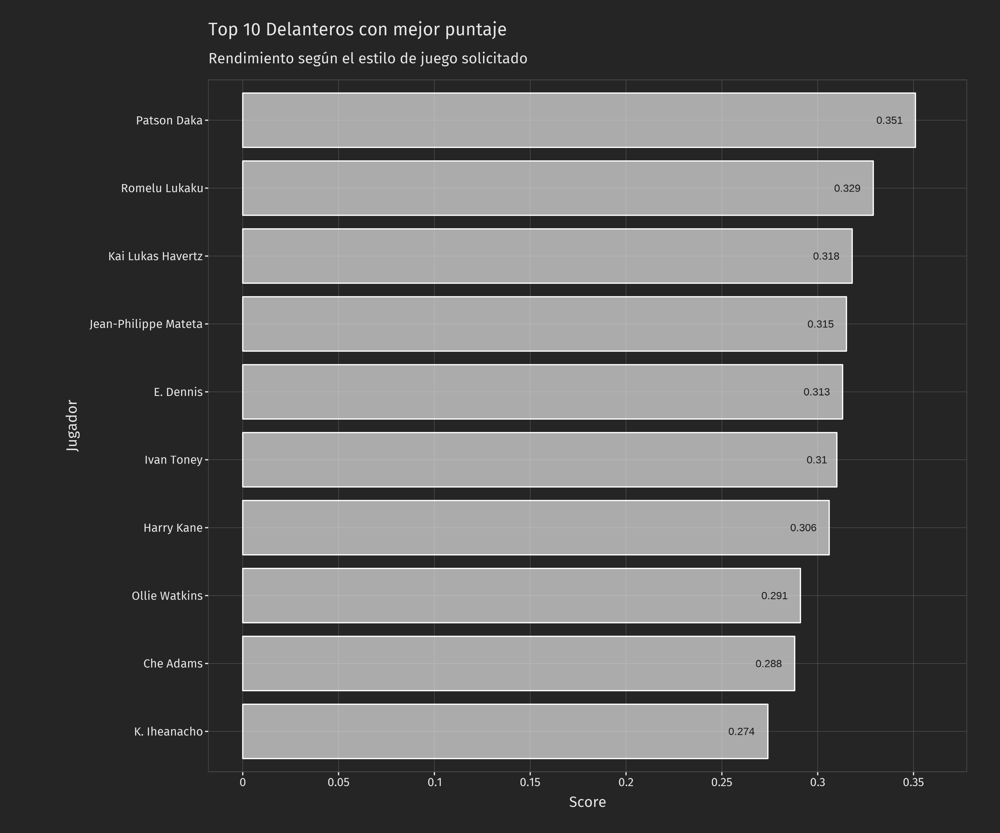
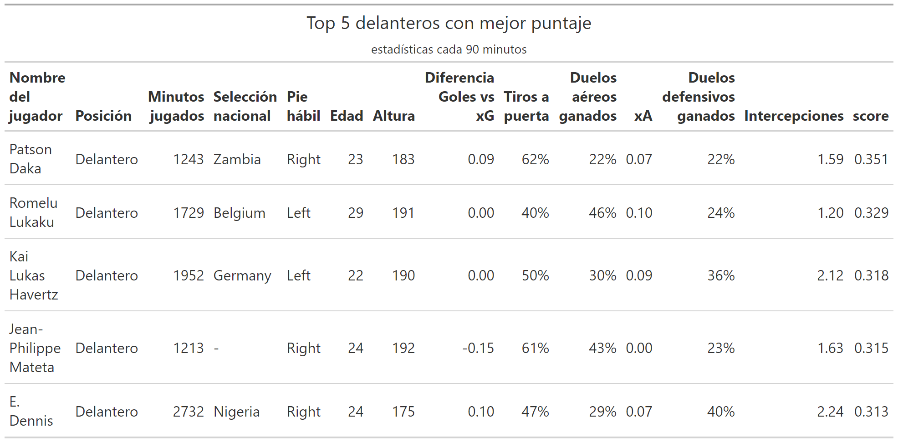

# Modelo de recomendacion de jugadores

Este proyecto es basado en [DATAZUL](https://repositorio.uchile.cl/handle/2250/176550), el primer caso de analytics aplicado al fútbol profesional en chile, que explica como generar un modelo de recomendación basado en estadística descriptiva.

El objetivo del modelo es entregar una lista de jugadores que cumplan con ciertos criterios para cada posicion, previamente definidos por la secretaría técnica y el club, tales como superar un umbral de minutos jugados y tengan un rendimiento sobresaliente. Para esto, a cada jugador se le asignará un puntaje segun su posicion y el rendimiento que tenga en esos criterios.

## Necesidades del club

Para fines didáticos tenemos a Melodia FC (club de fantasía) que necesita para mejorar su plantilla un delantero centro que no pase de 30 años y se adapte al estilo de juego del club. Para esto se va a aplicar el modelo de recomendación de jugadores, para recomendarle al scout al menos 5 jugadores que puedan encajar en el club y así facilitar el proceso de busqueda y fichaje de ese delantero. Hay que tener en cuenta que se va a buscar este jugador en la Premier League de Inglaterra, que debe haber jugador al menos el 30% de los minutos posibles y el club va a tener un límite de presupuesto.

El club ha asignado una serie de métricas para cada una de las posiciones y a cada métrica le ha asignado un puntaje, dado que se consideran variables distintas en cada posiciones, este puntaje no es comparable entre posiciones, por ejemplo, el % de duelos defensivos ganados va a tener mayor relevancia en un defensa central que en un delantero centro, con este puntaje por métrica va a ser mas óptimo asignarle un puntaje a cada jugador segun el rendimiento que tenga en cada posicion.

En la siguiente tabla se puede ver a cada posicion con una serie de métricas a evaluar y entre paréntesis está el valor que tiene esa métrica en esa posición

| **Defensa Central**                | **Laterales**                      | Volante Central                    | **Volante Interior**               | **Extremo**                       | **Delantero Centro**              |
|------------------------------------|------------------------------------|------------------------------------|------------------------------------|-----------------------------------|-----------------------------------|
| \% duelos aéreos ganados (40%)     | \% centros precisos (40%)          | pases claves precisos (35%)        | pases claves precisos (30%)        | \% duelos ganados (30%)           | diferencia Goles - xG (25%)       |
| \% duelos defensivos ganados (30%) | \% duelos defensivos ganados (30%) | \% duelos defensivos ganados (25%) | intercepciones (20%)               | \% centros precisos (30%)         | \% tiros al arco (25%)            |
| \% pases precisos (10%)            | \% duelos ofensivos ganados (20%)  | \% centros precisos (20%)          | xA (20%)                           | xG (15%)                          | \% duelos aéreos ganados (25%)    |
| pases claves precisos (10%)        | xA (10%)                           | intercepciones (10%)               | \% duelos defensivos ganados (15%) | xA (15%)                          | xA (15%)                          |
| faltas cometidas (10%)             |                                    | xA (10%)                           | xA (15%)                           | \% duelos defensivos ganados (5%) | \% duelos defensivos ganados (5%) |
|                                    |                                    |                                    |                                    | intercepciones (5%)               | intercepciones (5%)               |

## Pasos para generar el modelo

1.  **Obtener las estadísticas de los jugadores**

    Previamente ya tenía un base de datos con las estadísticas de los jugadres de la Premier League de Inglaterra en la temporada 21/22, donde se encuentran datos de evento, como por ejemplo, tiros a puerta, pases clave, duelos defensivos, así como también información sobre el club donde juegan, la cantidad de minutos disputados o el nombre del jugador. Lo importante para esta fase es tener los datos de eventos de los jugadores a analizar.

2.  **Contextualizar los datos**

    Como hay jugadores que han disputado más minutos que otros, sería erróneo comparar un jugador que hizo 3 goles y jugó solo 3 partidos a un jugador que hizo 6 goles pero jugó 20 partidos, esto pasa con práticamente todas las métricas que se utilizan, para evitar estos problemas hay que pasar los datos a cada 90 minutos o también llamado p90, siendo así más objetivo el poder analizar a los jugadores sin que sea tan influyente cuandos minutos disputó en el torneo. La fórmula para poder generarlo es: `métrica/minutos jugados*90` . Otra cosa a tener en cuenta es que los datos llevador a porcentaje, como % de pases precisos, no hay que pasarlos a p90 ya que estos están contextualizados.

3.  **Filtrar según necesidades del club**

    Para este caso Melodía FC necesita un jugador en la posicion de delantero, menor a 30 años , que haya disputado al menos el 30% de los minutos posibles y no tiene límite de presupuesto de fichaje.

4.  **Obtener Percentiles de las métricas**

    Los percentiles son medidas estadísticas que se utilizan para comparar el rendimiento de un jugador con el rendimiento de otros jugadores generalmente en la misma posición. Por ejemplo, si un jugador tiene un percentil de 0.75 en tiros a puerta, esto significa que el jugador supera al 75% de los jugadores en esta métrica. Para esto se recomienda tener previamente los datos filtrados según las necesidades y tenerlos contextualizados a p90.

5.  **Generar el Score del jugador**

    El score es un puntaje que representa el rendimiento de un jugador en una determinada posición y según el estilo de juego que necesite el club para esa posición. Se calcula multiplicando cada métrica por el valor que tenga esa métrica (según el estilo de juego), elevarlas al cuadrado, sumar todas las métricas y luego obtener la raíz cuadrada de ese valor.

    

    En el gráfico se puede observar que el jugador que mejor puntaje tiene para el estilo de juego de la posicón de delantero es Patson Daka jugador del Leicester con un puntaje de 0.351, también que del top 10, todos tienen un puntaje mayor de 0.27 y 7 de ellos tiene un puntaje mayor a 0.3. Para facilitarle el proceso al scout, vamos a seleccionar a los 5 jugadores con mejor puntaje para compararlos entre ellos y ver en que se diferencian y en que sobresalen.

6.  **Comparación de jugadores**

    

En la tabla se puede observar más a detalle las estadísticas de esos 5 delanteros que tuvieron mejor puntaje con respecto al estilo de juego que necesita el club. Para saber que tanto sobresale cada jugador en que métricas, veamos estas estadísticas con un gráfico para cada uno, donde la barra es su percentil (que tanto rinde en comparación el resto de los jugadores) y en el cuadro amarillo es el valor de la métrica cada 90 minutos.

Hay que tener en cuenta que un jugador por tener un buen puntaje, no quere decir que sobresalga en todas las métricas analizadas, sino que como están ponderadas, algunas métricas tienen más peso que otras, por ejemplo se valora más un delantero que tenga mejor rendimiento en los tiros a puerta que en las intercepciones.

## Posibles Mejoras y Aplicaciones del modelo

-   Analizar y graficar cada métrica con cada jugador para mejorar el analisis individual

-   Analizar el estilo de juego de los equipos actual del jugador para dar contexto, con esto se puede entender mejor que un jugador pueda tener menor rendimiento defensivo ya que su equipo suele tener el balón la mayoría del tiempo teniendo así pocos eventos relacionadas con la defensa.

-   Crear una aplicación web con [Shinny App](https://www.shinyapps.io/) para facilitar y agilizar el proceso de búsqueda de estos jugadores

-   Aumentar la base de datos de jugadores a analizar

-   No se tiene que limitar para el scouting de jugadores, también se puede analizar como están rindiendo los jugadores que ya están en el club según el estilo de juego que necesitan.

-   Tener datos de eventos de los jugadores para saber con que frecuencia y en que partes del campo ocurrieron estas acciones

## Consideraciones

-   La precisión y calidad de estos análisis va a depender en grán medida de los datos disponibles, mientras mas informacion útil se tenga, mas potencial se puede tener en cada uno

-   Este modelo de recomendacion o cualquier otro modelo descriptivo no busca saltar ni omitir ningún rol dentro del scouting sino optimizar recursos para mejorar y generar una mayor confianza en la búsqueda de potenciales fichajes de jugadores según lo que el club necesite

-   Este modelo de recomendación está basado en el proyecto [DATAZUL](https://repositorio.uchile.cl/handle/2250/176550), primer caso de analytics aplicado al fútbol profesional en chile

-   Este trabajo fue con fines didáticos, pero puede ser aplicado como método complementario medir el rendimiento de juegadores en clubes profesionales de fútbol. El repositorio con el código lo puedes conseguir [aquí](https://github.com/Daniher01/ejercicios_bigdata_futbol/tree/main/ejercicios/score_players).
