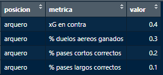
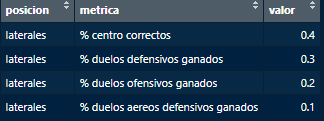
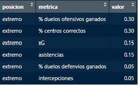
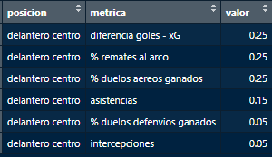

# Recomendación de jugadores según el modelo de juego

## Métricas según posición

### Arquero

### Defensa Central

### Laterales

### Volante central

### Volante interior

### Volante ofensivo

### Extremo

### Delantero centro

